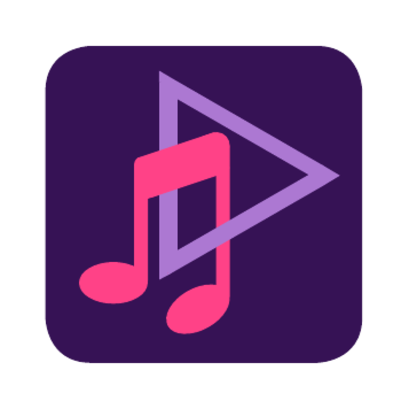

  
  
  # ZyncWave
  
  **Reproductor de música Android con soporte de descarga**
  
  
  
  

---

## Funciones

- Reproductor de música local
- Ecualizador de audio
- Editor de letras
- Gestión de playlists
- Selector de carpetas
- Descarga de audio y video

---

## 📥 Descarga

Descarga el APK más reciente desde [Releases](https://github.com/Cookie-seeker/ZyncWave/releases/latest)

---

## ¿Encontraste un bug?

Abre un [Issue] y cuéntanos:
- Qué pasó?
- En qué dispositivo?
- Detalla el error

---

## Tecnologías

- Kotlin
- Jetpack Compose
- MediaPlayer API
